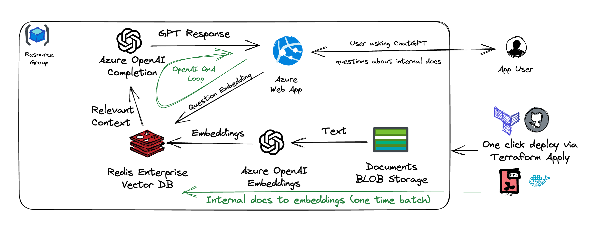

# Redis Azure OpenAI Template

This repo is an example that can be used to "one-click" deploy Azure OpenAI applications, using Redis Enterprise as a vector database.



In a single terraform script it deploys:

- Azure OpenAI instance with `text-davinci-003` and `text-embedding-ada-002` models
- Azure Redis Enterprise as a vector Database
- Azure Storage bucket with all the files from the `./docs` folder
- Azure Web App

## Example application

Example application allows you to use ChatGPT to analyze the documents, previoslyy unknown to ChatGPT and/or internal to your organization.

There are two data flows in the app. First - batch generation of embedding from the document context. Resulted embedding are stored in Azure Redis Enterprise. Second - using these embeddings to generate the context aware prompt to ChatGPT, so it answers questions, based on the context of the internal documents.

Questions you can try:

- What are the main differences between the three engine types available for the Chevy Colorado? Format response as a table with model as a first column

- What  color options are available? Format as a list

App credits - https://github.com/RedisVentures/LLM-Document-Chat


## Deploying the app

You need to specify unique name prefix for your deployment either by editing `terraform.tfvars` or in command line:

Also, you can add your own documents to the `./docs` folder (PDF or plain text), so they can be uploaded to the bucket during the deployment.

```
terraform init
terraform apply -var name_prefix="my-deployment-001-"
```


It might take up to 20 minutes to provision all the required infrastructure.

At the end terraform script would output bunch of the variables.
```
app-url = "anton-tf-webapp.azurewebsites.net"
openai-endpoint = "https://anton-tf-openai1.openai.azure.com/"
openai-key = <sensitive>
redis-endpoint = "anton-tf-redisenterprise.eastus.redisenterprise.cache.azure.net"
redis-password = <sensitive>
redis-port = 10000
storage-account = "antontfbucket"
storage-account-connection-string = <sensitive>
storage-container = "data"
```

app-url can be used to immediatly access the application.

## Configuration

Use `terraform.tfvars` to override default resource name prefix and container image to deploy with the webapp. You might need to override at least the app prefix to make sure it does not conflict with other instances deployed already.

TODO: introduce account-local random addon to endpoint names, so the same defaults can be used on multiple subscriptions.

## Pererequisites and Limitations

Azure Open AI currently (May 2023) is in the private preview. You need to submit the request to Microsoft to enable it for your account.

Azure OpenAI embedding API currently has strict limits on the request frequency, which might make it not feasible for bulk embedding generation. Consider using local embedding such as:
```
        from langchain.embeddings import HuggingFaceEmbeddings
        embeddings = HuggingFaceEmbeddings(model_name="all-MiniLM-L6-v2")
```

## Testing locally

While Azure OpenAI and Azure Redis Enterprise can not be deployed locally, you can use your local machine for testing the application itself.

After running the `terraform apply` you can use the generated Azure services to test your application code locally. Use .env.template as an example and populate it with actual keys and URLs.

```
docker build -t llm-chat .  
docker run -it -p 80:80 --env-file=.env llm-chat
```

Building/pushing the multiplatform image (useful for local development on Mac/ARM):

```
docker buildx build --platform linux/amd64,linux/arm64 -t antonum/llmchat:latest --push  .
```